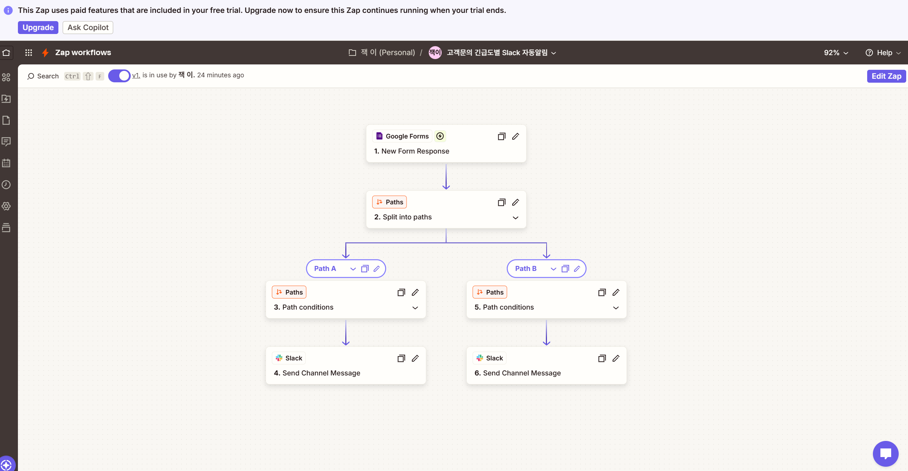
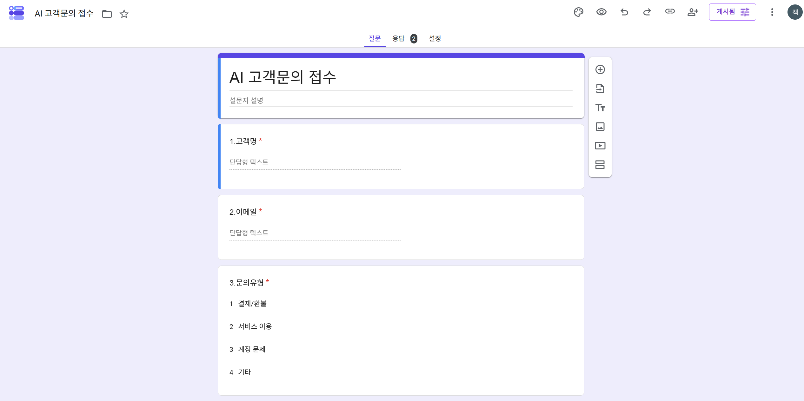
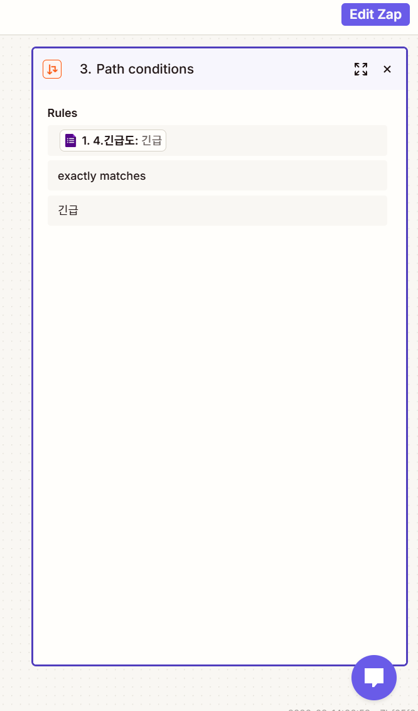
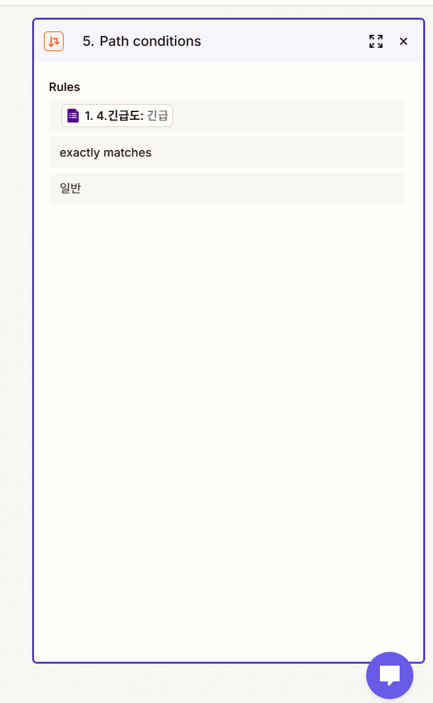
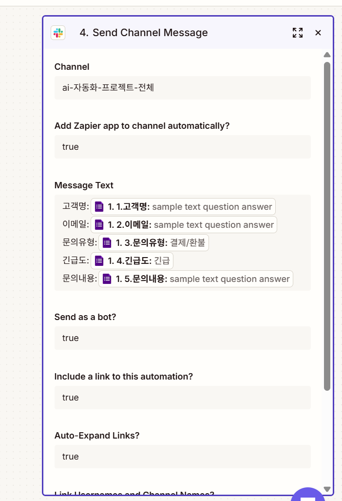
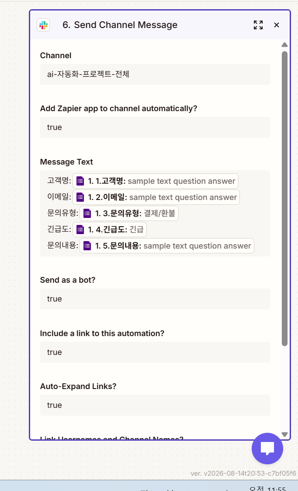
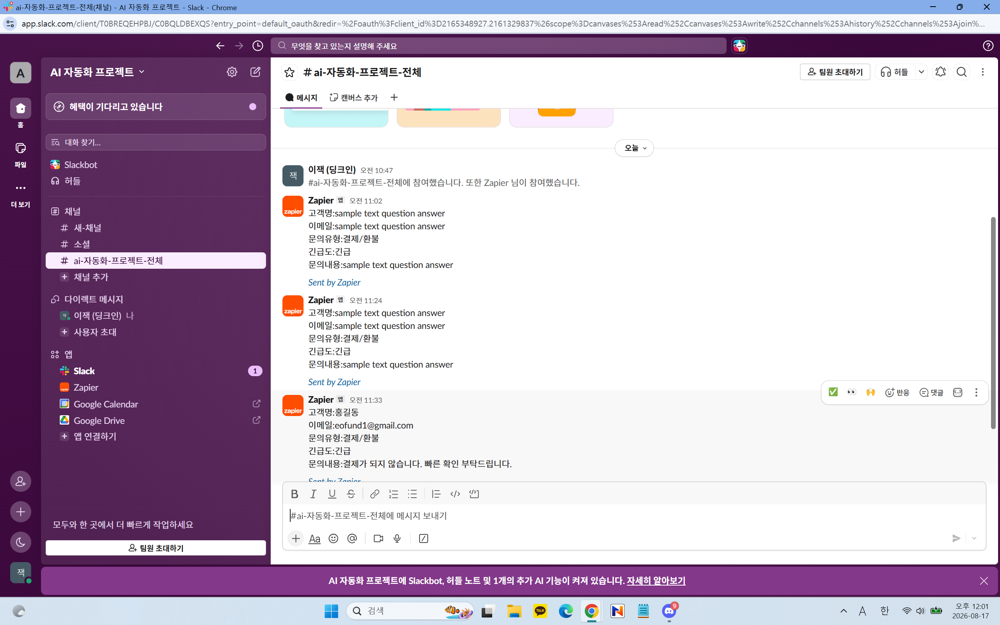

프로젝트 2. Zapier를 활용한 고객 문의 자동 분류 및 Slack 알림

1. 프로젝트 개요

1-1. 자동화할 반복 업무

고객 문의가 들어올 때마다 담당자가 문의 내용을 직접 확인하고, 긴급
문의인지 일반 문의인지 판단한 후 관련 내용을 전달하는 작업은 반복적으로
발생한다.

본 프로젝트에서는 이 반복 업무를 자동화하기 위해 Google Forms로 고객
문의를 접수하고, Zapier에서 긴급도를 기준으로 조건 분기한 뒤, Slack
채널로 문의 내용을 자동 전송하는 워크플로우를 구현하였다.

1-2. 자동화 목적

고객 문의를 자동으로 수집한다.

문의의 긴급도에 따라 자동으로 분류한다.

분류된 문의 내용을 Slack으로 자동 전달한다.

사람이 문의를 하나씩 확인하고 전달하는 반복 업무를 줄인다.

Trigger, Action, 조건 분기를 포함한 실제 자동화 워크플로우를
구현한다.

2. 자동화 도구 선정

2-1. 선정 도구

Zapier

2-2. Zapier 선정 이유

이번 프로젝트에서는 자동화 도구로 Zapier를 선정하였다.

첫째, Google Forms와 Slack을 별도의 코딩 없이 연결할 수 있기
때문이다. 고객이 Google Forms에 문의를 제출하면 해당 데이터를 Zapier가
받아 Slack으로 전달하는 흐름을 비교적 간단하게 구성할 수 있다.

둘째, Zapier의 Paths 기능을 이용하면 조건에 따른 분기 처리가
가능하다. 이번 프로젝트에서는 긴급도가 긴급인지 일반인지에 따라
서로 다른 경로를 실행해야 하므로 Paths 기능이 프로젝트 요구사항에
적합하였다.

셋째, Trigger와 Action을 시각적인 워크플로우 형태로 설정할 수 있어
자동화의 전체 흐름과 각 단계의 역할을 쉽게 확인할 수 있다.

넷째, Google Forms, Slack 등 다양한 외부 서비스와의 연동을 지원하므로
향후 이메일 발송, Google Sheets 저장, 담당자 알림 등의 기능을
추가하기에도 적합하다.

따라서 Google Forms의 고객 문의를 조건에 따라 분류하고 Slack으로 자동
전달하는 이번 반복 업무에 Zapier가 적합하다고 판단하였다.

3. 전체 자동화 워크플로우

구현한 전체 흐름은 다음과 같다.

Google Forms
고객 문의 작성
      ↓
Trigger
New Form Response
      ↓
Paths by Zapier
조건 분기
   ↙          ↘
Path A        Path B
긴급           일반
   ↓            ↓
Action 1      Action 2
Slack         Slack
Send Channel  Send Channel
Message       Message

구성 요소

구분        사용 기능                      역할

입력        Google Forms                   고객 문의 입력
Trigger     New Form Response              새로운 Form 응답 감지
조건 분기   Paths by Zapier                긴급도에 따라 경로 분리
Path A      긴급도 = 긴급                  긴급 문의 처리
Action 1    Slack - Send Channel Message   긴급 문의 전송
Path B      긴급도 = 일반                  일반 문의 처리
Action 2    Slack - Send Channel Message   일반 문의 전송

본 워크플로우는 과제 공통 요구사항인 Trigger 1개 이상, Action 2개
이상, 조건 분기 1개 이상을 포함하도록 구성하였다.

📸 [캡처 1] Zapier 전체 워크플로우

4. Trigger 구현

4-1. Trigger

자동화의 시작점은 Google Forms이다.

App: Google Forms
Trigger Event: New Form Response

고객이 Google Forms에 새로운 문의를 제출하면 Zapier가 새로운 응답을
감지하고 자동화가 시작된다.

Google Forms에는 다음 정보를 입력하도록 구성하였다.

입력 항목   설명

고객명      문의한 고객의 이름
이메일      고객 이메일
문의유형    문의 종류
긴급도      긴급 / 일반
문의내용    문의 상세 내용

이 중 긴급도 값을 이후 Paths의 조건 분기 기준으로 사용하였다.

📸 [캡처 2] Google Forms / Trigger

5. 조건 분기 구현

이번 자동화의 핵심은 고객이 선택한 긴급도를 기준으로 문의를 두 경로로
나누는 것이다.

Zapier의 Paths by Zapier를 사용하였다.

5-1. Path A --- 긴급 문의

5-2. Path B --- 일반 문의

6. Action 구현

조건 분기 후 각 경로에서 Slack Action이 실행된다.

Action 1 --- 긴급 문의

Path A
↓
Slack
↓
Send Channel Message

긴급 문의에 해당하면 고객 문의 정보를 Slack 채널로 전송한다.

Action 2 --- 일반 문의

Path B
↓
Slack
↓
Send Channel Message

일반 문의에 해당하면 고객 문의 정보를 Slack 채널로 전송한다.

따라서 하나의 Trigger에서 조건에 따라 서로 다른 경로를 거쳐 2개의
Action이 실행될 수 있도록 설계하였다.

7. Slack 메시지 데이터 연결

Google Forms에서 받은 데이터를 Slack의 Message Text에 연결하였다.

고객명: [Google Forms 고객명]
이메일: [Google Forms 이메일]
문의유형: [Google Forms 문의유형]
긴급도: [Google Forms 긴급도]
문의내용: [Google Forms 문의내용]

즉, 고객마다 내용을 다시 입력하는 것이 아니라 Google Forms의 응답값이
자동으로 Slack 메시지에 들어가도록 Field Mapping하였다.

📸 [캡처 5] Slack Action / Field Mapping

8. 실제 실행 결과

Zapier에서 Slack Action을 테스트하여 메시지가 Slack으로 정상 전송되는
것을 확인하였다.

전체 데이터 흐름은 다음과 같다.

Google Forms 입력
        ↓
New Form Response
        ↓
긴급도 확인
        ↓
Paths 조건 분기
    ↙           ↘
  긴급           일반
    ↓             ↓
Slack Action   Slack Action

9. 분기 경로별 실행 결과 확인

공통 요구사항에서는 조건 분기 구조뿐 아니라 각 분기 경로가 실제로 1회
이상 실행된 결과를 확인할 수 있어야 한다.

따라서 최종 제출에서는 가능하면 다음 두 경우를 각각 실행한다.

테스트 A

긴급도 = 긴급
→ Path A
→ Slack Action

테스트 B

긴급도 = 일반
→ Path B
→ Slack Action

두 종류의 테스트 문의를 Google Forms에서 각각 한 번씩 제출하고 각 경로의
실행 결과를 확인한다.

10. 워크플로우 단계별 설명

1단계 --- 입력

고객이 Google Forms에 문의 내용을 입력한다.

입력 데이터

고객명
이메일
문의유형
긴급도
문의내용

2단계 --- Trigger

새로운 Form Response가 생성되면 Zapier가 이를 감지한다.

3단계 --- 조건 판단

Zapier Paths가 긴급도 값을 확인한다.

4단계 --- 분기

긴급 → Path A
일반 → Path B

5단계 --- Action

각 Path의 Slack Send Channel Message가 실행된다.

6단계 --- 결과

Slack 채널에서 고객 문의 내용을 확인할 수 있다.

11. 과제 요구사항 충족 확인

공통 요구사항

공통 요구사항                     프로젝트 2 구현                  충족

실제 동작하는 자동화 워크플로우   Google Forms → Zapier → Slack    O
Trigger 1개 이상                  Google Forms New Form Response   O
Action 2개 이상                   Path A Slack / Path B Slack      O
조건 분기 1개 이상                Paths by Zapier                  O
분기 경로별 실행 결과 확인        긴급 / 일반 각각 테스트          캡처로 증빙

프로젝트 2 요구사항

프로젝트 2 요구사항           구현 내용                      충족

자동화할 반복 업무 1개 정의   고객 문의 분류 및 전달         O
도구 1개 선정                 Zapier                         O
도구 선정 이유 작성           연동성·Paths·노코드·확장성     O
자동화 흐름 구현              Google Forms → Paths → Slack   O
워크플로우 흐름 설명          단계별 설명 작성               O
실행 결과 화면 포함           Zapier Test + Slack 결과       캡처 첨부

12. 자동화 결과 및 효과

이번 프로젝트를 통해 고객 문의를 사람이 직접 확인하고 분류하여 전달하던
반복 업무를 자동화하였다.

기존 방식:

문의 확인
→ 긴급도 확인
→ 분류
→ 담당 채널에 전달

자동화 이후:

Google Forms 제출
→ Zapier 자동 감지
→ 긴급도 자동 분기
→ Slack 자동 전달

이를 통해 반복적인 확인 및 전달 작업을 줄일 수 있으며, 긴급 문의와 일반
문의를 조건에 따라 자동으로 처리할 수 있다.

13. Zapier를 사용하며 확인한 특징

장점

코딩 없이 Google Forms와 Slack을 연결할 수 있다.

Trigger와 Action의 구조가 시각적으로 보여 이해하기 쉽다.

Paths를 이용해 조건별 자동화를 구현할 수 있다.

다양한 외부 서비스와 연결할 수 있어 확장이 쉽다.

한계

복잡한 조건과 분기가 많아질수록 워크플로우 관리가 어려워질 수 있다.

일부 고급 기능은 요금제에 따라 제한될 수 있다.

복잡한 데이터 처리나 세밀한 오류 제어는 코드 기반 자동화보다
제한적일 수 있다.

적합한 상황

Zapier는 여러 웹 서비스를 빠르게 연결하고 비교적 단순한 반복 업무를
자동화해야 하는 경우에 적합하다고 판단하였다.